# project-4-group-2
Final bootcamp project analyzing liver cirrhosis data and using machine learning to predict cirrhosis stages.  
Members: Amy Dohlin, Anna Bitzer, Tianyue Li, Christine Jauregui

### Topic: Liver Cirrhosis Stage Prediction  
### Dataset: Liver Cirrhosis Stage Classification 🩺 (kaggle.com) (25,000+ rows)  
Goal: Create, train and deploy a neural network machine learning model that can predict liver cirrhosis stage based on patient lab result data.   

### What is Liver Cirrhosis?  
Cirrhosis results from prolonged liver damage, leading to extensive scarring, often due to conditions like hepatitis or chronic alcohol consumption. The data provided is sourced from a Mayo Clinic study on primary biliary cirrhosis (PBC) of the liver carried out from 1974 to 1984.  

### Attribute Information:    
N_Days: Number of days between registration and the earlier of death, transplantation, or study analysis time in 1986  
Status: status of the patient C (censored), CL (censored due to liver tx), or D (death)  
Drug: type of drug D-penicillamine or placebo  
Age: age in days  
Sex: M (male) or F (female)  
Ascites: presence of ascites N (No) or Y (Yes)  
Hepatomegaly: presence of hepatomegaly N (No) or Y (Yes)  
Spiders: presence of spiders N (No) or Y (Yes)  
Edema: presence of edema N (no edema and no diuretic therapy for edema), S (edema present without diuretics, or edema resolved by diuretics), or Y (edema despite diuretic therapy)  
Bilirubin: serum bilirubin in [mg/dl]  
Cholesterol: serum cholesterol in [mg/dl]  
Albumin: albumin in [gm/dl]  
Copper: urine copper in [ug/day]  
Alk_Phos: alkaline phosphatase in [U/liter]  
SGOT: SGOT in [U/ml]  
Tryglicerides: triglicerides in [mg/dl]  
Platelets: platelets per cubic [ml/1000]  
Prothrombin: prothrombin time in seconds [s]  
Stage: histologic stage of disease ( 1, 2, or 3 )  

### __PHASE I: Data Cleaning__  
- With a JupyterNotebook in VSCode, we read in the liver_cirhosis.cvs file into a dataframe. 
- Next we checked for null values in the liver_cirhosis.csv file and removed any rows with null values.  
- We also checked the data types for the columns in the dataframe and used the drop.duplicates function to remove any repeated rows.  
  
- After removing duplicate records, the file dropped from 25,000 to 10,000 rows.   
-  We wrote the data in this modified dataframe to a csv file, liver_clean.csv.   

### __PHASE 2: Preliminary Visualizations__   
- Using a Jupyter Notebook and MatplotLib, we created overviews of the data in liver_clean.csv.
- We noted that the number of patients in each Stage of the disease (our target variable) were roughtly equal.

- We explored the relationship between 'Stage' and 'Number of Months' between registration and the earlier of death, transplantation, or study analysis time in 1986. The latter feature we calculated from the N_Days feature (Number of days between registration and the earlier of death, transplantation, or study analysis time in 1986).
  
- The results were unsurprising. The lower the stage of Cirrhosis, the more time elapsed between patient registration and death, transplantation, or study analysis time. The more advanced the stage of the disease, the sooner the onset of death or liver transplantation.   

### __PHASE 3: SparkSQL Queries__
- We used SparkSQL to look at different aspects of the data to get an idea of how different symptoms, genders, and drugs impacted the stages of liver disease.
- We initiated a Spark session in the ETL notebook and created a temporary view called “Stages”. In this step we also did a quick conversion of 'Age' from unix to years.
- Overall, we would have benefited from using SparkSQL during the data exploration process (instead of after we had built and optimized our models). The information we learned about the bodily elements could have helped us whittle down the number of columns needed for machine learning and possibly have given us different results. This will be an important lesson in future projects.

Information gleaned from Spark queries:
- The number of patients that were on the placebo was higher in each stage of liver disease, whereas the number of patients on D-Penicillamine was lower for each stage.

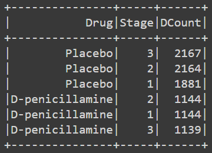
    
- The number of side effects (ascites, hepatomegaly, spiders, edema) present was greater in stage 3 patients than in stage 1 or 2 patients.
    
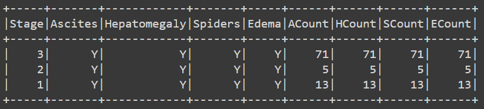
  
- Stage 1 liver cirrhosis had the largest average of days, whereas stage 3 had the lowest average.
    
 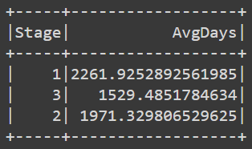
    
- The majority of patients in general were female.
    
 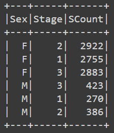
    
- The average age of patients with stage 1 cirrhosis was 49.9 years old, stage 2 had an average age of 49.1, and stage 3 had an average age of 52.4.
    
 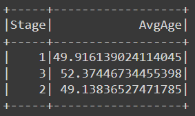
    
- Bodily element measurements:
  - Normal ranges (found through various Google queries):
      
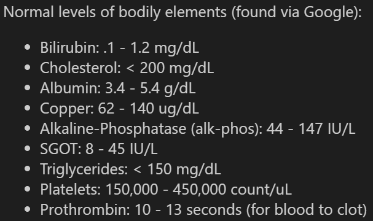
      
  - We found averages of Bilirubin, Cholesterol, Albumin, Copper, Alkaline-Phosphatase (alk-phos), SGOT, Triglycerides, Platelets, and Prothrombin across four groups in all stages (female patients on placebo, female patients on D-penicillamine, male patients on placebo, male patients on D-penicillamine).
  - All groups were found to have elevated levels of bilirubin, cholesterol, alk-phos, and SGOT, which are indicators of the liver functioning improperly and a likely diagnosis of liver cirrhosis.
  - Almost all groups had normal values for albumin, copper, triglycerides, platelets, and prothrombin.
  - Female patients with stage 3 cirrhosis, both on placebo and D-penicillamine had below normal amounts of albumin in their system, which is a common indicator of cirrhosis and can cause symptoms such as ascites (fluid/swelling in abdomen) and edema (fluid/swelling in legs).
      
 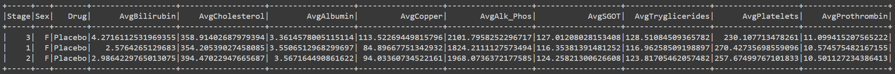
 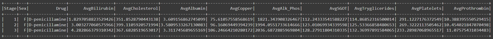
 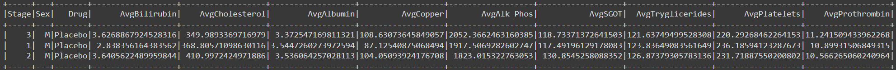
 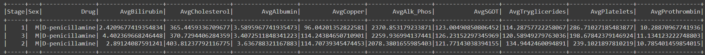

### __PHASE 4: Data Transformation__    
- We read the liver_clean csv into a Google Colab notebook, where we saved the data into a Pandas dataframe, liver_clean_df.
- We defined a list of eight categorial variables on which to run a single instance of OneHoteEncoder.
- We created a dataframe of the encoded variables and their values, which all became 0.0 or 1.0.
- We concatenated the encoded variables dataframe with the liver_clean_df and dropped the original columns that we had to encode. 
- We defined Y as the values in the encoded 'Stages' feature, Stage_1, Stage_2, and Stage_3. This created a target variable with three classes. Y=liver_clean_df[["Stage_1", "Stage_2","Stage_3"]]  
- We defined X as the values in all other columns of the dataframe (except the three Stage features. X=liver_clean_df.drop(["Stage_1", "Stage_2", "Stage_3"],axis=1) This left the X data with 27 features. 
- To prepare for the neural networks models, we split the preprocessd data into training and testing datasets for X and Y.
- Next, we used the StandardScalar method to scale the X_train and X_test data, which we saved as NumPy arrays called X_train_scaled and X_test_scaled.
- Because the Y data was stored as a pandas DataFrame, we used .to_numpy on Y_train and Y_test to convert them to arrays. 

### __PHASE 5: Neural Network Models__   
**Neural Network Model #1**
- For the first iteration of the neural network model, we set the number of input features and number of nodes in the two hidden layers to equal the shape of the X_train_scaled dataset, 27.  
- For the output layer we set the activation to 'softmax' and the units to 3, to accommodate the three target variable values. 
- Hidden Layers 1 and 2 were activated with "relu".
- We compiled the model with loss set to binary crossentropy, required given the number of target variable classes was above 2.
- After fitting, compiling, and training the model (100 epochs), we noted an accuracy score of 62.9%.
- This score was considerably lower than the accuracy scores returned during the training epochs, which reached as high as 70.0%.
- We interpreted this results as indicative of the model learning the training data better than it was able to generalize to the new, testing, data. In other words, the model was very likely overfitting. 

**Neural Network Model #2**
- For the second iteration of the neural network model, we kept the number of input features at 27 but doubled the nodes in the hidden layers to 54.  
- All other model chacteristics remained the same as in the previous version.  
- This version of the model returned an accuracy score of 65.0% after 100 epochs.  
- Again, the accuracy scores for the training epochs (reaching 92.8%) were much higher than that for the test. The model was continuing to overfit. 
  
**Neural Network Model #3**  
- The third iteration of the model was similar to the previous iteration, but two additional hidden layers with 54 nodes each and relu activation were included in this attempt.
- This model version produced an accuracy score of 63.4%, lower than the previous iteration.  
- That training epochs returned accuracy scores as high as 98.0% in 100 epochs, but the score fell to 94.2% by the last epoch.
- Like the two previous iterations, this version of the model appeared to overfit the training data. 

### __PHASE 5: Neural Network Model Optimization__  

**Optimizing for Accuracy with KerasTuner**
- As none of the first three iterations of our neural network achieved high accuracy scores, we used KerasTuner to decide    
a) which activation function to use  
b) the number of neurons in the first layer  
c) the number of hidden layers and neurons in the layers
in order to optimize for accuracy.  

*-----Include things about results of KerasTuner ------*

*__Are these from the Random Forest or the Optimized NN model?*__  
- In our evaluation of the optimized model, we created a confusion matrix and generated a correlation heatmap. 
- The confusion matrix ...

  *__Can we make a correlation heatmap when Y has three classes?*__
- The correlation heatmap indicated the strongest positive correlation (0.65) between Spiders_N and Ascites_N and between Spiders_Y and Ascites_Y. This is to be expected as Spider angiomas tend to appear in patients with chronic liver disease and ascites.
- The next highest positive correlation (0.42) is observed between Bilirubin and Status_D (Death). This is unsurprising as high bilirubin levels in the blood are indicative of improperly functioning liver, a risk factor for death in people with cirrhosis.
- We also noticed a positive correlation of 0.39 between Ascites_N and Drug_Penicillamine and a positive correlation of 0.39 between Ascites_Y and Drug_Placebo. This appears logical because Penicillamine is a drug used to treat ascites. It stands to reason that patients receiving the Placebo instead of Penicillamine would be more likely to test positive for Ascites while those recieving the Penicillamine would be more likely to test negative for Ascites. 

Enhanced Neural Network:

After optimization:

**Optimizing with Principal Component Analysis**
- Another optimization that we tried was a Principal Component Analysis model.
- We used a standard scaler on the liver_clean_df to scale the data, then created the PCA model with n_components = 3.
- In the next step we found the explained variance and the total explained variance. The largest total variance was 38.4%, which means that a maximum of 38% of the original data was retained in the PCA model, and is an indicator that this type of model would not be a good method for this dataset. Despite this, we continued with the PCA model to see what the results would be.  
- Next we employed the elbow method on the PCA model where we used a for loop to calculate sets of k-values and inertia values. Once that was complete we created a plot to show the elbow curve, where it was determined that the best k-value to use would be 4.
  
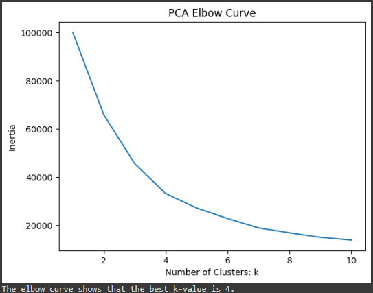
  
- We calculated the predictions with n_clusters = 4 and random_state = 0, and created a scatter plot with the results. Three distinct clusters can be seen, with a fourth cluster that is interspersed between all of them.

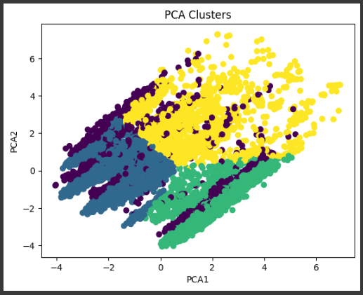
  
- Since the fourth cluster was so dispersed, we decided to run the PCA model again with n_clusters = 3 and random_state = 0. This yielded three very distinct clusters and could be considered a better result than four clusters.
  
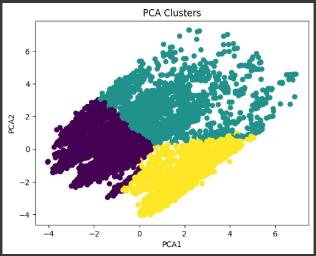

- Overall, a PCA model was not a good choice for this dataset. PCA assumes a linear relationship between variables, and our dataset did not have linear relationships. Another reason is that PCA results are more difficult to read, especially in this case where the target variables are removed prior to applying the PCA calculation and scaling the data.
- PCA attempts to determine the most important variables and breaks them down into a specified number of PCA-components (we used 3). The main difficulty with this is that the components do not specify which variables the model chose or what weights they hold.
- If we had done SparkSQL queries earlier in the project, PCA would have possibly been better if we had manually removed unnecessary variables first and then created the model.

### __PHASE 6: Random Forest Models__   
We decided to try using a Random Forest Model on the data because they are robust against overfitting, robust to outliers and non-linear data, and efficient on large databases.  
- After reading the processed liver_clean.cvs file into dataframe liver_clean_df, we separated the features from the target variable.
- The dataframe creation process created a new column called "Unnamed: 0", a new index identical to the original index. We dropped this column and the 'Stage' feature from our definition of X.
- We specified the y variable as 'Stage'. 
- Next we identified the categorical features in the dataframe by getting the counts of each features' values.
- Because Edema had three values, not just Y or N like the other categorical fields, we set Edema aside to later apply the "get dummies" function.
- For the categorical features with only two values, we replaced the Y values with 0s, the N values with 1s, the D-penicillamine value in Drug with 1s, and the Placebo value in Drug with 0. We set all new values to integer type.
- We used the "get dummies" function to encode the remaining categorical variables, Status and Edema, and turn their values into integers.
- After splitting the data into training and testing sets, we scaled the X_train, X_test, y_train, and y_test sets.
- Then, we created a random forest classifier with 500 estimators and 42 random states.
- After fitting the model on X_train_scaled and y_train, we used the model to make predictions with the test data, X_test_scaled.
- We calculated and displayed the model's accuracy score and classification report, and used the seaborn heatmmap to produce a confusion matrix. 

- At 86.8%, the overall accuracy score was a significant improvement over the neural network models' accuracies. 
- Precision and recall were also high, ranging from 83% to 91% and 86% to 91%, respectively.  
- The Random Forest Model did a good job at classifying Stage 1, Stage 2, and Stage 3 liver cirrhosis.  
- Querying for the top 5 features of most importance returned, in descending order: Prothrombin, Platelets, Albumin, N_Days, and Age.  
- When we plotted a bar chart that identifies, in descending order, all the features and their importance to the model, we noticed several things.  
  1) The categorical features, such as 'Spiders', 'Ascites', 'Edema', 'Sex', and 'Status', had the least importance to the model's classification power.
  2) Among the non-categorical features, which we scaled, one group stood out as most imporant. That group included Prothrombin, Platelets, Albumin, N-Days, Age, and Bilirubin.
  3) A second group of non-categorical features, including Copper, SGOT, Alk_Phos, Cholesterol, Hepatomegaly, and Tryglicirides, was identified as moderately important. 

With the classification results of the Random Forest Model we plotted a series of bar charts  in Tableau to visualize the importance of various features on the determindation of 'Stage'. 

__Prothrombin, feature importance 0.13__  
According to the Mayo Clinic, the protein Prothrombin is one of many factors in the blood that help it to clot. Prothrombin time is the number of seconds it takes for a patient's blood to clot. The Prothrombin time test is one of many tests used to check people for liver disease and to screen people waiting for liver transplants. Blood normally clots in 10 to 13 seconds. Liver damage is one cause of blood clotting slower than average.   

- In the count of observations versus Prothrombin time graph, we see that most patients -- including those with Stage 1, Stage 2 and Stage 3 of the disease -- are within the normal range of 10 to 13 seconds.  
- Within that range, Stage 3 patients increase in counts as Prothrombin time increases.   
- Meanwhile, Stage 1 and Stage 2 patients appear more heavily concentrated at the lower end of the normal range.   
- These obervations align with the fact that Prothrombin time is one, but not the only, factor in determining blood clotting speed.  
- They also align with the fact that the blood's ability to clot decreases as disease worsens.   

__Platelets, feature importance 0.11__  
Johns Hopkins School of Medicine describes a normal platelet count as 150,000 to 450,000 platelets per microliter of blood. People with less than 150,000 have a condition called thrombocytopenia. This condition makes it more difficult for blood to clot. Medical researchers have documented thrombocytopenia in up to 76% of patients with chronic liver disease, and approximately 13% of patients with cirrhosis. The condition can postpone or interefere with diagnostic and therapeutic procedures, as it increases the risk of bleeding in patients.   
  
- In the Platelets graph we can see that most of the Stage 1, Stage 2, and Stage 3 patients have platelet counts within the normal range.  
- At the same time, however, a large segment of Stage 3 patients are clustered at or around the 150,000 point.  
- As in the Prothrombin graph, we don't see dramatically abnormal test resuls but we do see noticeable differences between patients stages.  

__Albumin, feature importance 0.11__  
According to the National Kidney Foundation, 3.5 g/dL to 5 g/dL (grams per deciliter) is the normal level of the protein albumin found in blood plasma. The University of Rochester Medical Center explains that the liver makes albumin and that lower levels of this protein in the blood can indicate liver disease. Per the University of California San Francisco Health, lower-than-normal albumin can accompany the presence of ascites, or fluid build up in the abdomen. 

- In the Albumin chart, Stage 1 and Stage 2 patients appear mostly within the normal range.
- Stage 3 patients are more clustered around the lower end of the normal range and also exhibit a longer left-hand-side "tail" in their distribution. This means Stage 3 patients extend far beyond the lower limits of the normal range.
- These observations are in line with the medical evidence that albumin levels decrease as liver disease advances.  

__Number of Days to Study End, feature importance 0.10__   
- The study end was marked by whichever came first of death, transplantation, or study analysis time.
- Stage 3 patients trended towards lower number of days in the study.
- Stage 2 patients clustered towards the middle of number of days in the study.
- Stage 1 patients were relatively evenly distributed across the range of days.
- These results suggest that the later the stage of cirrhosis, the more likely that patients would end the study early - perhaps due to death or transplantation.

__Age, feature importance 0.09__   
- Study patients ranged in age from 25 to 80 years old.  
- The Stage 1 patients were predominantly in their early 40s to early 60s.
- The Stage 2 patients were largely in their early 40s to early 60s.
- The bulk of the Stage 3 patients were between mid 40s and early 60s.
- Among patients aged mid 60s to early 70s, about half were Stage 3.
- This suggests that chronic liver disease can begin at Stage 1 at relatively young ages; it's not a disease one acquires simply by aging.

Visit Tableau dashboard to filter by stage: https://public.tableau.com/app/profile/anna.bitzer/viz/CirrhosisPredictionsNotebook/Top5RandomForestFeatures

Create Training Model (Google Colab, incorporate SQL/Spark): Amy, Christine  
Look at models like random forest, neural networks, etm.  
Categorical vs discrete variable cleaning (one-hot encoding)  
Drop irrelevant columns, if any  
Training vs test data  
Choose various neural network parameters  
Optimize Model: Tianyue, Anna  
Use PCA to eliminate less-impactful factors to make our model concise and strong  
Analyze the model accuracy using confusion matrix and classification report  
Use tensorflow to optimize the activation function  
Document changes along the way, and effect on accuracy  
Resulting Visualizations (Tableau?): Group  
Highlight the findings of our neural network   
ReadMe: Group  
Presentation: Anna	  

### Techniques/Skills to Use:   
* Pandas  
* Tableau  
* Matplotlib  
* SQL / Spark  
* Softmax  

### References & Acknowledgements:
* We would like to thank our instructor Hunter Hollis, teaching assistant Randy Sendek and Sam Espe for their guidance throughout this project.
* Model optimization for multi-category output: https://stackoverflow.com/questions/61550026/valueerror-shapes-none-1-and-none-3-are-incompatible
* Seaborn documentation: https://seaborn.pydata.org/generated/seaborn.heatmap.html
